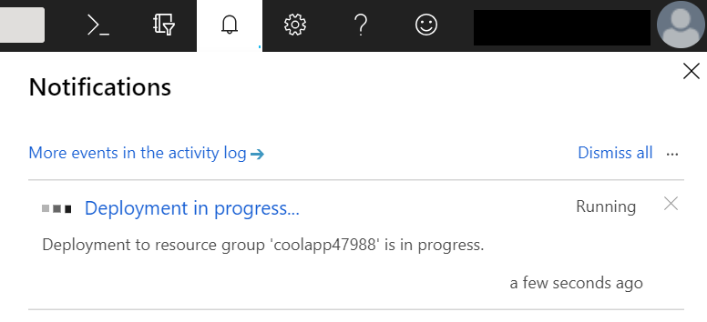

*This article is part of CodeProject's [Serverless Challenge](https://www.codeproject.com/Competitions/1076/Serverless-Challenge.aspx).*

## Introduction
Welcome! In this tutorial, we’re going to be creating a simple but fun HTTP API using Azure Functions. 

If you’re new to Serverless and are wondering what all of the fuss is about, I suggest you take a few minutes to read my [introductory article](https://www.codeproject.com/Articles/1278907/What-is-Serverless-and-Why-Should-You-Care). There, I give a high level over what Serverless is all about and why “Serverless” isn’t as horrible a name as you might be thinking it is. 

## Getting Started
If you don’t have an Azure account yet, you’ll need to create one first. Click here to jump to the account creation page. 

You'll need a credit card to create a free trial account, even though you won't be billed. I know this is a bit annoying, but all of the cloud providers do this to prevent people from getting an unlimited number of free trials just by creating new e-mail addresses.

If you already have an Azure account, the Functions service has a free tier than never expires, so you’ll be able to complete this tutorial without incurring any charges. 

Once you are signed into the Azure portal, you can create your first serverless function by clicking on 'Create a resource, then Compute, and then Function App:

 

 Next, you'll see this screen that asks you to fill some information about your app:

 

 Start by choosing a name for your function app. Since it will be hosted on the azurewebsites.net domain, you'll need to pick a name that nobody else has used. 

 Next, you'll need to create a new Resource Group. Think of a resource group has a handy container that bundles up all of the bits of your app. This is helpful when your apps grow larger, because you can ensure that all of the functions, permissions, and other settings related to your app are kept in a logical bundle that makes them easy to monitor and manage. 

 By default, Azure will try to use your app name as the resource group name. I suggest sticking with this unless you have a reason not to. 

 For the rest of the settings, use what is shown in the image above: Windows OS, Consumption Plan, Central US as the location, and JavaScript as the runtime stack. Let Azure create new storage for your function app. 

 When you've done all of this, click 'Create'. Azure will pop up a notification telling you that deployment is in progress. If you click the notifications icon at the top of the screen, you'll see the deployment status of your app:

 

 When deployment finishes, the notification will update to tell you so:

 

 Click on the 'Go to resource' button, and you'll be taken to your Function App's dashboard:

 

 So we now have a Function App, but we haven't added any actual functions to it. Let's fix that! On the app dashboard, click on the '+ New function' button. This will open a dialog asking you to choose your development environment:

 

 Choose the 'In-portal' option. This way, you won't have to install anything on your computer to get your serverless app up and running. 

 In a real-world scenario, where you'll working on serverless apps that contain many functions, you'll probably want to use Visual Studio, VS Code, or another text editor or IDE of your choice. But for small projects like ours, using the in-portal editor makes the app creation process quick and easy! 

 After we've chosen our development environment, Azure will ask us to choose the type of function we want:

 

 Choose 'Webhook + API'. This will give us a function that is set up to respond to HTTP requests. Once you've chosen this option, Azure will create your function, populate it with some default code, and send you to a code editor for your new function:

 

 If you want to see the default code in action, click on the 'Get function URL' link. Copy the link provided, paste it in a new browser tab, and load it. 

 You'll notice that your function complains that you need to provide a name as part of the query string. 

 If you look at the URL, you'll notice that it already contains a query parameter called 'code'. By default, Azure generates an access code for every serverless function to prevent unauthorized access. 

 While you'd want to add a more sophisticated access control policy to a production application, the Azure-generated access code is perfect for our first serverless function since we just creating it for ourselves. 

 Since the URL already has a query string, simply append
 ```
 &name=Bob
 ```
 to the end of the URL in your browser, and hit Enter. This time, the function will say hello to Bob! 

 And with that, we have a serverless app created, running, and responding to HTTP requests. Notice all of the things we *didn't* have to do: we didn't have to install Node.js, or a web server or, a web framework. We filled out a short form, clicked a few times, and ended up with a functioning web application. 

 ## Customizing the Code

Now that we have our function in place, let's make it do something useful! 

We're going to turn our serverless function into a geocoding service - it will take a POST request that contains a street address in the body, and will return a set of map coordinates for that street address. 

To do this, we'll need to use Azure Maps. Like Azure Functions, Azure Maps has a free tier that we will be making use of. To use Azure Maps, we'll need to create a new resource in the Azure Portal. 

Start by clicking 'Create resource', and then enter 'Maps' in the search box:


In the drop down box that appears, click 'Maps'. This will bring up a screen with more information on the Maps service. Click the 'Create' button on this screen to proceed:


This will take you to the Azure Maps account creation screen. As you can see, it will be associated with your Free Trial account, or your existing Azure account if you had one before beginning this exercise:


Add the maps account to the resource groups you already created for your Function App. Pick a name for your maps account. Anything will work! 

For the Pricing Tier, choose 'Standard S0'. This tier will do everything we need, and our usage will fall into the Azure Maps' free tier. 

When you're done, click 'Create' and Azure will add the Maps resource to your resource group. When it is ready, you'll be taken to an overview page:


Click on the 'Go to resource' button, which will take you to the dashboard for your maps account:


Click on the Authentication menu item under Settings. This will bring up some information that we're going to need very soon:


For the purposes of this exercise, the value you'll want to pay attention to is the Primary Key. Copy it somewhere, or leave the map Authentication screen open in a browser tab, because you'll need it in just a minute!

With our maps account created, it's time to go and make a serverless function that can take an address and turn it into a latitude and longitude - and, it turns out, a lot of other information as well! 

Load up your Function App by clicking the Functions App item in the Azure Portal menu, and then click on the app you created earlier to load its dashboard. We're going to create a new function to handle our mapping functionality.

In your app dashboard, click the + icon beside the Functions menu item:


When asked for a function type, choose HTTP Trigger:


Give the new function any name you'd like, and leave its authorization level set to Function:


Click 'Create', and you'll be taken to your new function's code. It will contain the same default code you saw earlier. Start by erasing *all* of the default code so you're left with a blank code editor. 

Next, replace it with the following code:

```javascript
const https = require("https");
const apiVersion = 1.0;
const mapsKey = "your maps key goes here";

const request = (url) => {
    return new Promise((resolve, reject) => {     
        https.get(url, (resp) => {
            let data = "";
            resp.on("data", (chunk) => {
                data += chunk;
            });

            resp.on("end", () => {
                const res = JSON.parse(data)
                resolve(res);
            });
        }).on("error", (err) => {
            reject(err);
        });
    });
}

module.exports = async function (context, req) {
    if (req.query.address) {
        const url = `https://atlas.microsoft.com/search/fuzzy/json?api-version=${apiVersion}&subscription-key=${mapsKey}&query=${req.query.address}`
        context.log(url);
        try {
            const data = await request(url);
            
            context.res = {
                status: 200,
                body: data.results
            };
        } catch(err) {
            context.res = {
                status: 500, 
                body: err
            }
        }
        context.done();
    } else if (req.query.memberId) {
        const url = `https://cdprj-sc.azurewebsites.net/api/GetCode?memberId=${req.query.memberId}`;

        const data = await request(url);
        if (data) {
            context.res = {
                body: data.result
            };
            context.done();
        }       
    }
    else {
        context.res = {
            status: 400,
            body: "Please pass an address as part of the query string."
        };
    }
};
```

You'll need to make one change: in the `mapsKey` variable on the third line of the code, paste in the Primary Key value for your maps account. 

Let's walk through the code a bit to see what's going on. We start by creating a helper function that wraps the Node.js `https` library in a Promise. This make our life easier later on, because we can use this request function with JavaScript's handy `await` keyword. 

Next, we export an `async` function that handles the request our serverless function receives, and returns a response. 

It checks if an `address` was received as part of the query string, and harangues the user if not.

If an address *was* received, then the function constructs a URL that makes a request to the Azure Maps service. Notice that we contains three query parameters: an API version, a subscription key, and a query. We pass in our Azure Maps key as the `subscription-key`, and pass in the address we're looking for as the `query`. 

Our code then fires off a request to Azure Maps. If we get a result, we output it. If we get an error, we output that instead. 

Astute readers will note that there's also a some code in there that checks for a query string parameter called `memberId`. This is a super-secret bit of code that we'll use later on to generate an entry code for the Serverless Challenge.

To test out your function, get your function's URL by clicking the 'Get function URL' link:


Paste it into your browser, and add an `address` item to the end of the query string by appending `&address=157 Awesome St.` to the end of the URL. Pick a real address, though. Try your own address and see what somes up It will look something like

```
https://my-awesome-app.azurewebsites.net/api/Mapper?code=abcdefg==&address=30 Yonge St, Toronto, ON
```

As you can see, I've called my serverless function and asked it to look up the address of the Hockey Hall of Fame. This call returns a result that looks like this:

```json
[
  {
    "type": "Point Address",
    "id": "CA/PAD/p0/3907925",
    "score": 9.894,
    "address": {
      "streetNumber": "30",
      "streetName": "Yonge Street, Heritage Highway",
      "municipalitySubdivision": "Toronto, Downtown Toronto, Church-Yonge Corridor, Bay Street Corridor",
      "municipality": "Toronto",
      "countryTertiarySubdivision": "Toronto",
      "countrySubdivision": "ON",
      "postalCode": "M5E",
      "extendedPostalCode": "M5E1X8",
      "countryCode": "CA",
      "country": "Canada",
      "countryCodeISO3": "CAN",
      "freeformAddress": "30 Yonge Street, Toronto, ON M5E1X8",
      "countrySubdivisionName": "Ontario"
    },
    "position": {
      "lat": 43.64694,
      "lon": -79.37712
    },
    "viewport": {
      "topLeftPoint": {
        "lat": 43.64784,
        "lon": -79.37836
      },
      "btmRightPoint": {
        "lat": 43.64604,
        "lon": -79.37588
      }
    },
    "entryPoints": [
      {
        "type": "main",
        "position": {
          "lat": 43.64699,
          "lon": -79.37698
        }
      }
    ]
  }
]
```

You'll see that in addition to the latitude and longitude, Azure Maps returned a lot of other information, too! 

In cases where someone provides an address but forgets to add a zip or postal code, you could use Azure Maps to look it up. 

## Contest Verification

Earlier, we noted that there's some code in our serverless function that checks for a `memberId` query parameter. 

This code takes your CodeProject member ID, and sends it off to CodeProject's very own serverless function, which will then give you a contest entry code. That's right! CodeProject is using a serverless function to generate an entry code for a contest that teaches you how to make serverless functions. It's serverless all the way down. 

First up, you'll need your CodeProject member ID. You can find it on your CodeProject profile page, which you can access by logging into CodeProject and clicking on your user name near the top right of the screen. 

On your profile page, you'll see a box near the right that has your member number and your picture. Here's my profile page, with my member number outlined in red to make it easy to see:


Now, you're going to make a request very similar to the one you made above to send an address to your function for geocoding. Except this time you're going to send your member number. 

All you'll need to do is take the URL you used to send in an address, strip the address off the end, and add your member ID. For me, it would look something like this:

```
https://my-awesome-app.azurewebsites.net/api/Mapper?code=abcdefg==&memberId=12303349
```
and it will return a result that looks like this:

```
Hello there, member 12303349, your entry code is 123456789
```

No, that's no my real entry code. And even if it were, it would only work for me. You'll have to use your own! 

Copy the entry code, and head on over to the code entry page [here](https://www.codeproject.com/script/Contests/EnterCode.aspx?cid=1076) to enter your code.


## Conclusion

That brings us to the end of our Serverless tutorial. We've created a serverless Function App on Azure, and hooked it up to Azure Maps to do some geocoding. 

And we've barely scratched the surface! You can set up serverless functions to react to events that happen inside your cloud provider. You're definitely not limited to responding to HTTP requests. You can have functions that are triggered when a file gets uploaded, or a database entry gets created, or any of a huge number of events. Here are a few links to learn more about serverless function triggers on several cloud providers:

[Azure Function Triggers](https://docs.microsoft.com/en-us/azure/azure-functions/functions-triggers-bindings)

[AWS Lambda Event Sources](https://docs.aws.amazon.com/lambda/latest/dg/invoking-lambda-function.html)

[Google Cloud Functions Events and Triggers](https://cloud.google.com/functions/docs/concepts/events-triggers)

[Alibaba Cloud Function Triggers](https://www.alibabacloud.com/help/doc-detail/70140.htm)

## Write an Article

Now that you're done, it would be a perfect time to write your own article for the Serverless Challenge. There are great prizes up for grabs!

Perhaps you could show up to use a serverless function to take video uploads and transcode them into a different format. 

Or you could write a complete serverless app with an Angular or React front-end, backed by an Azure SQL database, CosmosDB, or AWS DynamoDB. 

The possibilities are endless! Why not come up with something great, share it with the world, and maybe win a prize while you're at it? 


